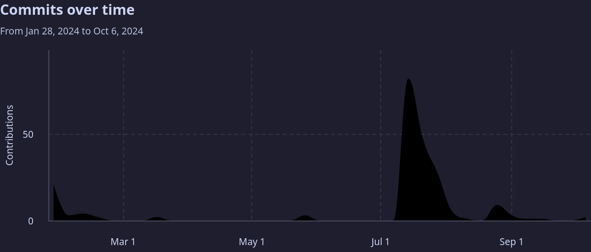

+++
title = 'HighlightOS Powraca'
date = 2024-10-12
author = 'Adam Perkowski'
cover = ''
tags = ['highlightos', 'rust']
keywords = ['rust', 'os', 'highlightos', 'linux']
description = "HighlightOS to x86_64 system operacyjny (kernel) stworzony w Assembly i Rust. I właśnie powraca!"
draft = true
showFullContent = false
hideComments = false
robotsdisallow = false
+++
# What is HighlightOS? 🤔
HighlightOS is a project I started earlier this year. 
It's a x86_64 operating system (kernel) made from scratch in Rust and Assembly.

Well, to be fair, it's not 100% from scratch. It still uses libraries like:
- <a href="https://github.com/rust-osdev/volatile" target="_blank">volatile</a>, which provides wrapper types for various raw pointers
- <a href="https://github.com/rust-osdev/x86_64" target="_blank">x86_64</a> for x86_64-specific instructions support
- <a href="https://github.com/rust-osdev/uart_16550" target="_blank">uart_16550</a> for UART devices support

and other libraries from <a href="https://github.com/rust-osdev" target="_blank">rust-osdev</a> so **huge** thanks for their amazing work.

(<a href="https://os.adamperkowski.dev" target="_blank">HighlightOS</a>)

# The History 📅

### Q1 of 2024
Originaly, HighlightOS was supposed to be an Assembly-based kernel with a bundled bootloader (+ some C additions) but I gave up on
this idea when it came to string comparison that's essential for a shell to work. 
I quickly gave up on the project, I had more important stuff to do at the time.

### July 2024
I finally mastered Rust. That's what I thought, at least. 
I've decided to write the kernel fully in Rust. I stumbled upon <a href="https://os.phil-opp.com" target="_blank">this guide</a> by
<a href="https://github.com/phil-opp" target="_blank">Philipp Oppermann</a> and I felt like **I had the power to finally do something**.

Until. 
I encountered a lot of issues. And I mean **a lot**. 
Memory allocation, interrupts, VGA, serial connection, linked lists, etc.

But I've managed to actually create something that worked. 
I released <a href="https://github.com/adamperkowski/highlightos/releases/tag/v0.3.0" target="_blank">The first release (v0.3.0)</a> at July 20th.
It was bad. Lots of bugs, nothing to see there.
<a href="https://github.com/adamperkowski/highlightos/compare/v0.3.0...v0.3.4" target="_blank">113 different commits to `main` since then</a>.

With the help of different <a href="https://github.com/adamperkowski/highlightos/graphs/contributors" target="_blank">contributors</a> the project
**skyrocketed**.

### August 2024
Yet another burnout. The last release I did was <a href="https://github.com/adamperkowski/highlightos/releases/tag/v0.3.3" target="_blank">v0.3.3</a>
on August 5th. 
HighlightOS went radio-silent for about 3 months; and that leads us to...

### Now (<a href="https://github.com/adamperkowski/highlightos/releases/tag/v0.3.4" target="_blank">v0.3.4</a>)
v0.3.4 is kind of an update / `yea I'm still alive`-type release. 
I got myself together and thought: `no, I can't just leave it like this`.

So here we are. I plan on finishing the <a href="https://github.com/adamperkowski/highlightos/pull/29" target="_blank">arrow keys system</a> and
overall improving the UX / performance for now.

# The Future 🗓️
My main goals for the future:
- Fixing any known bugs
- Separating HLShell from the kernel
- Improving compatibility / device integration
- Dropping <a href="https://github.com/rust-osdev/bootloader" target="_blank">rust-osdev/bootloader</a> and creating an independent one (?)
- Supporting UEFI
- Multiple TTY-like shell instances (when the shell is detached)

# Contributing 🛠️
The project is fully open-source (licensed under <a href="https://github.com/adamperkowski/highlightos/blob/main/LICENSE" target="_blank">GPL-3.0</a>).
 
To anyone reading this: if you find any bugs / want to help with development or add some new features, please feel free to contribute = open
<a href="https://github.com/adamperkowski/highlightos/issues" target="_blank">Issues</a> or
<a href="https://github.com/adamperkowski/highlightos/pulls" target="_blank">Pull Requests</a> through GitHub.
❤️
